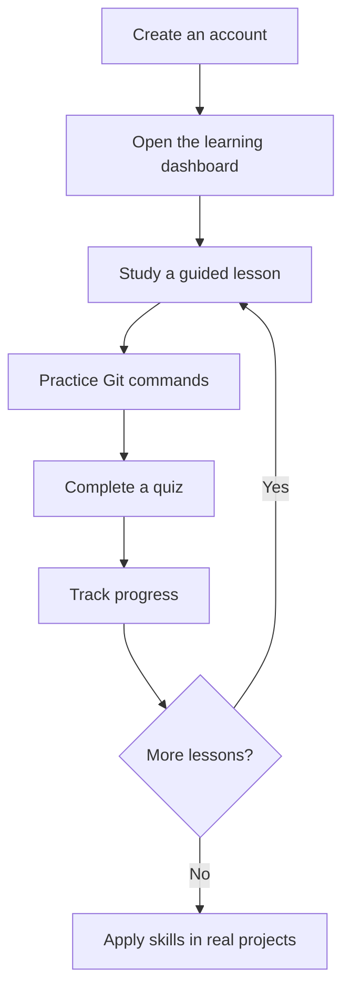
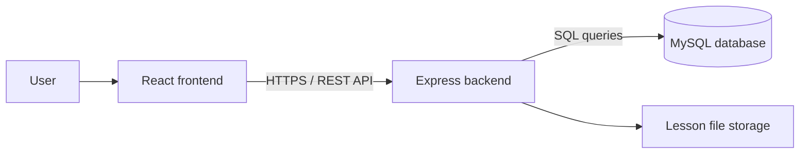

# GitHero

<div align="center">

### Master Git and GitHub Through Practice

**A beginner-friendly learning platform for building practical Git and GitHub skills through guided lessons, command practice, quizzes, and visible progress.**

[](https://react.dev/)
[](https://expressjs.com/)
[](https://www.mysql.com/)
[](https://vite.dev/)
[](#project-status)

[Live Application](https://githero-kappa.vercel.app) · [Features](#key-features) · [Getting Started](#getting-started) · [Roadmap](#roadmap)

</div>

---

## Overview

GitHero is a web-based learning platform designed to help new developers understand Git and GitHub without feeling overwhelmed by complex tools or workflows.

The platform combines short learning modules, hands-on command practice, quizzes, simplified repository activities, and progress tracking in one beginner-friendly workspace. It helps students move from learning Git concepts to confidently applying them in real development projects.

## The Problem

Beginners often struggle with Git and GitHub because they must learn several unfamiliar concepts at once:

- Git commands and their effects
- Repositories, files, commits, and branches
- GitHub collaboration workflows
- Code editors and terminal-based tools
- Merge conflicts and common mistakes corrections

This learning curve can create confusion and fear of making mistakes. GitHero provides a safe and structured environment where users can learn step by step and receive clear feedback while practicing.

## Project Objectives

- Make Git and GitHub easier to understand for beginners.
- Provide guided, practical learning instead of text-heavy instruction.
- Allow users to safely practice common Git commands.
- Show measurable progress across lessons and quizzes.
- Prepare learners for real-world GitHub workflows.
- Encourage knowledge sharing through developer-written workflow content.

## Key Features

| Feature | Description |
| --- | --- |
| **Guided Modules** | Structured learning modules introduce Git and GitHub concepts in a beginner-friendly order. |
| **Lesson Resources** | Individual lessons may include downloadable PDF learning materials. |
| **Command Practice** | A simplified Codespaces-style area validates Git commands and returns clear success or error feedback. |
| **Repository Practice** | Users can create repositories and simple files to understand how repository content changes. |
| **Quizzes** | Short assessments help users review concepts and measure understanding. |
| **Progress Dashboard** | Displays completed lessons, module progress, quiz activity, and the next lesson to continue. |
| **Quick References** | Provides convenient access to frequently used Git commands and explanations. |
| **Workflow Hub** | Allows experienced developers to share practical Git workflows, advice, and learning posts. |
| **User Profiles** | Users can manage profile information and view repositories associated with a profile. |
| **Admin Management** | Administrators can manage modules, lessons, publication status, and lesson resources. |
| **Light and Dark Modes** | Supports an accessible interface for different viewing preferences. |

## Target Users

GitHero is intended for:

- First-year Software Engineering and IT students
- New programmers learning version control
- Beginners using GitHub for the first time
- Students preparing for team-based development projects
- Self-learners who prefer guided, hands-on practice

## How GitHero Works



## Technology Stack

### Frontend

- React
- Vite
- Tailwind CSS
- React Router
- Axios
- Lucide React

### Backend

- Node.js
- Express.js
- JSON Web Token authentication
- bcrypt password hashing
- Multer file uploads

### Database

- MySQL
- Aiven cloud database hosting

### Deployment

- Vercel — frontend
- Render — backend API
- Aiven — MySQL database

## System Architecture



The frontend handles the user interface and communicates with the Express REST API. The backend manages authentication, business logic, progress tracking, repository data, community content, and lesson resources. MySQL stores application data using relational tables and foreign-key relationships.

## Core Data Model

The current database design includes entities for:

- Users and profiles
- Modules and lessons
- User lesson progress
- Quizzes and quiz progress
- Repositories and files
- Community posts

Indexes can be applied to frequently searched and joined fields such as user IDs, module IDs, lesson IDs, usernames, and post creation dates to improve query performance.

## Getting Started

### Prerequisites

Install the following software before running the project locally:

- [Node.js](https://nodejs.org/) 18 or later
- npm
- MySQL 8 or access to a compatible cloud MySQL service
- Git

### 1. Clone the repository

```bash
git clone https://github.com/your-username/GitHero.git
cd GitHero
```

Replace `your-username` with the GitHub account or organization that owns the repository.

### 2. Install dependencies

```bash
cd client
npm install

cd ../server
npm install
```

### 3. Configure environment variables

Create the required environment files for the frontend and backend. Match the variable names to those used by the project source code.

Example frontend configuration:

```env
VITE_API_URL=http://localhost:5000
```

Example backend configuration:

```env
PORT=5000
DB_HOST=localhost
DB_PORT=3306
DB_USER=your_mysql_user
DB_PASSWORD=your_mysql_password
DB_NAME=githero_db
JWT_SECRET=replace_with_a_secure_random_value
CLIENT_URL=http://localhost:5173
```

> Never commit real passwords, tokens, database certificates, or `.env` files to GitHub.

### 4. Prepare the database

Create the MySQL database and import the project schema:

```bash
mysql -u your_mysql_user -p githero_db < path/to/schema.sql
```

### 5. Run the application

Start the backend:

```bash
cd server
npm run dev
```

Start the frontend in a second terminal:

```bash
cd client
npm run dev
```

Open `http://localhost:5173` in a browser.

## Suggested Project Structure

```text
GitHero/
├── client/                 # React frontend
│   ├── src/
│   │   ├── admin/
│   │   ├── api/
│   │   ├── components/
│   │   ├── context/
│   │   └── features/
│   └── package.json
├── server/                 # Express backend
│   ├── src/
│   │   ├── controllers/
│   │   ├── middleware/
│   │   ├── routes/
│   │   └── server.js
│   ├── upload/
│   └── package.json
└── README.md
```

The exact structure may differ as the project evolves.

## Security Considerations

- Passwords are hashed before database storage.
- Protected routes require verified JSON Web Tokens.
- Admin operations require authorization checks.
- Server-side validation is applied to user input and uploaded files.
- CORS should allow only approved frontend origins in production.
- Secrets and database credentials must remain in environment variables.
- SQL queries should use parameterized statements to reduce injection risk.

## Project Status

GitHero is currently under active development as a Software Engineering academic project. Core learning, progress, repository, profile, community, and administrative experiences are being implemented and refined.

Some features may use mock data while their final database integration is completed.

## Roadmap

- [x] User authentication and protected dashboard
- [x] User profiles
- [x] Guided modules and lessons
- [x] Lesson progress tracking
- [x] Community workflow posts
- [x] Basic repository practice
- [ ] Complete quiz-progress integration
- [ ] Expand Git command validation and practice scenarios
- [ ] Add full collaborative repository practice
- [ ] Simulate branches, pull requests, and merge conflicts
- [ ] Improve accessibility and responsive behavior across all pages
- [ ] Add more learning modules and assessments

## Future Work

The main planned extension is a collaboration mode where learners can work together in shared practice repositories. This feature is expected to demonstrate common GitHub workflows such as branching, reviewing changes, resolving conflicts, and merging contributions in a controlled learning environment.

## Team

GitHero is developed by **3Bugs**, Team 11, as a Software Engineering group project. Development is organized by features, with each member responsible for implementing assigned functionality while collaborating on shared design and integration decisions.

## Contributing

GitHero is currently an academic project. If external contributions are opened in the future:

1. Fork the repository.
2. Create a feature branch: `git checkout -b feature/your-feature`.
3. Commit your changes: `git commit -m "feat: add your feature"`.
4. Push the branch: `git push origin feature/your-feature`.
5. Open a pull request with a clear description and testing notes.

## Acknowledgements

- [Git](https://git-scm.com/) for distributed version control
- [GitHub](https://github.com/) for collaborative development workflows
- Open-source tools and learning resources used throughout development

---

<div align="center">

**GitHero — Learn it. Practice it. Master it.**

</div>